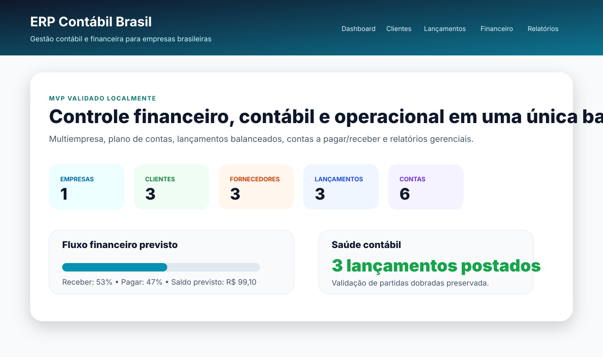
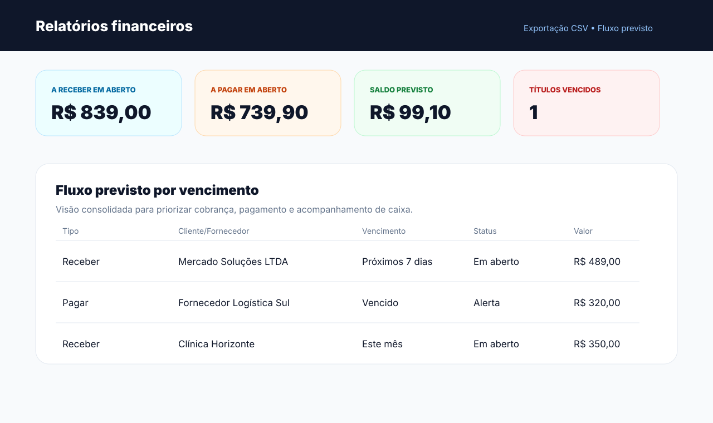
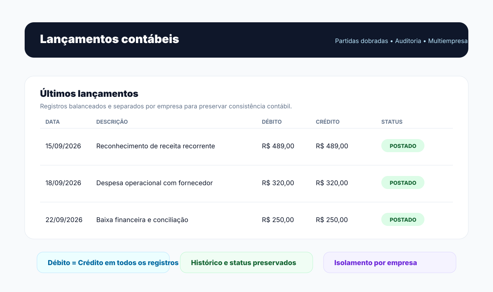

# ERP Contábil Brasil

Base inicial profissional para um sistema ERP contábil brasileiro, criada do zero para evoluir com segurança.

Versão local atual: `v0.1.4-demo`.

## Demonstração visual

| Dashboard | Relatórios financeiros | Lançamentos contábeis |
| --- | --- | --- |
|  |  |  |

Essas imagens usam dados fictícios da demo local e destacam os módulos principais do MVP:
dashboard operacional, fluxo financeiro e lançamentos contábeis com validação de partidas dobradas.

## Escopo inicial do MVP

- Cadastro de empresas.
- Clientes e fornecedores.
- Plano de contas.
- Lançamentos contábeis com validação de débito/crédito.
- Dashboard operacional.
- Trilha de auditoria.
- Estrutura preparada para PostgreSQL, deploy e testes.

Importante: este projeto ainda não declara conformidade fiscal, SPED, NF-e, eSocial ou obrigações legais. Essas etapas precisam de validação contábil/jurídica antes de uso oficial.

## Como rodar localmente

Clone o repositório e entre na pasta do projeto:

```bash
git clone https://github.com/Brunof94-debug/erp-contabil-brasil.git
cd erp-contabil-brasil
```

No Windows PowerShell:

```powershell
python -m venv .venv
.\.venv\Scripts\Activate.ps1
pip install -r requirements-dev.txt
Copy-Item .env.example .env
python manage.py migrate
python manage.py seed_demo
python manage.py runserver
```

No macOS/Linux:

```bash
python -m venv .venv
source .venv/bin/activate
pip install -r requirements-dev.txt
cp .env.example .env
python manage.py migrate
python manage.py seed_demo
python manage.py runserver
```

Depois acesse:

```text
http://127.0.0.1:8000/
```

Para testar rapidamente, use o login demo criado pelo `seed_demo`:

```text
usuário: demo
senha: demo12345
```

Criar um superusuário é opcional e só é necessário para acessar o painel administrativo do Django:

```bash
python manage.py createsuperuser
```

## Telas disponíveis

- `/` — dashboard.
- `/login/` — login.
- `/cadastro/` — cadastro público de usuário.
- `/senha/recuperar/` — recuperação de senha por e-mail.
- `/onboarding/empresa/` — primeiro acesso para criar/vincular empresa.
- `/admin/` — administração Django.
- `/empresas/` — empresas.
- `/clientes/` — clientes.
- `/clientes/importar/` — importação CSV de clientes.
- `/fornecedores/` — fornecedores.
- `/fornecedores/importar/` — importação CSV de fornecedores.
- `/plano-de-contas/` — plano de contas.
- `/plano-de-contas/importar/` — importação CSV do plano de contas.
- `/lancamentos/` — lançamentos contábeis.
- `/financeiro/receber/` — contas a receber.
- `/financeiro/pagar/` — contas a pagar.
- `/financeiro/relatorios/` — fluxo previsto, vencidos e resumo mensal.
- `/financeiro/receber/exportar.csv` — exportação CSV de contas a receber.
- `/financeiro/pagar/exportar.csv` — exportação CSV de contas a pagar.
- `/financeiro/relatorios/exportar.csv` — exportação CSV do fluxo previsto.
- `/healthz/` — healthcheck.

As telas internas exigem login. Para avaliação do projeto, use o usuário demo informado acima.
Esse usuário fica vinculado à `Contábil Aurora Demo`, permitindo testar o isolamento por empresa.
O seed inclui dados fictícios profissionais: clientes, fornecedores, plano de contas,
lançamentos balanceados, contas a receber, contas a pagar e vencimentos variados.

## Primeiro acesso de novos usuários

Usuários comuns sem empresa vinculada são enviados para:

```text
/onboarding/empresa/
```

Nessa tela o usuário cria a própria empresa e passa a enxergar apenas os dados dela.
Superusuários continuam com visão administrativa geral.

## Importação CSV

As importações aceitam arquivos UTF-8 com separador vírgula ou ponto e vírgula.
Os registros são sempre vinculados à empresa do usuário logado.

- Clientes: `nome`, `documento`, `email`, `telefone`.
- Fornecedores: `nome`, `documento`, `email`, `telefone`.
- Plano de contas: `codigo`, `nome`, `tipo`.

Tipos aceitos no plano de contas:

```text
ATIVO, PASSIVO, PATRIMONIO, RECEITA, DESPESA
```

## Cadastro público

Novos usuários podem criar conta em:

```text
/cadastro/
```

Após criar a conta, o usuário entra automaticamente e é levado para o onboarding da empresa.

## E-mail e recuperação de senha

Por padrão, o projeto usa backend de console:

```text
EMAIL_BACKEND=django.core.mail.backends.console.EmailBackend
```

Isso permite testar recuperação de senha localmente sem provedor externo. Em produção,
configure SMTP ou provedor transacional por variáveis de ambiente, sem colocar secrets no Git.

## Deploy demo

O projeto já inclui configuração básica para deploy demo:

- `Procfile` com `collectstatic`, `migrate` e Gunicorn;
- `runtime.txt` com Python 3.12;
- `railway.json` com healthcheck em `/healthz/`;
- suporte a `DATABASE_URL`, `DJANGO_ALLOWED_HOSTS` e `CSRF_TRUSTED_ORIGINS`.

Use o [RUNBOOK.md](RUNBOOK.md) para conferir variáveis mínimas e checks antes de publicar.

## Documentação do projeto

- [PRODUCT_SPEC.md](PRODUCT_SPEC.md) — especificação inicial.
- [ROADMAP.md](ROADMAP.md) — evolução planejada.
- [RUNBOOK.md](RUNBOOK.md) — operação e deploy demo.
- [SECURITY.md](SECURITY.md) — princípios de segurança.
- [CHANGELOG.md](CHANGELOG.md) — histórico de versões.
- [PORTFOLIO.md](PORTFOLIO.md) — resumo profissional para currículo/GitHub.
- [RELEASE_CHECKLIST.md](RELEASE_CHECKLIST.md) — checklist final da demo local.

## Próximas fases

1. Fechar requisitos do MVP comercial.
2. Definir módulos fiscais/contábeis obrigatórios.
3. Implementar autenticação multiusuário por empresa.
4. Criar telas CRUD completas.
5. Adicionar relatórios financeiros e contábeis.
6. Preparar deploy staging/production.
